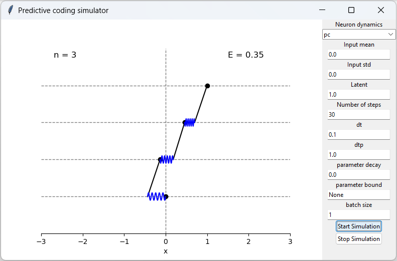

# Visualising a predictive coding network

## Description

This repository visualizes inference and learning in predictive coding networks. The objective is to play around with the visualisation to get an intuition of how PCN perform inference and learns.

## Features

- Visualising PC and MCPC inference as well as other (faster) equivalent inference schemes.
- Allow for weight decay and weight clipping.
- Learning on batches of data as well as single data points.

## Installation

1. Clone the repository: `git clone https://github.com/your-username/your-repo.git`
2. Install the dependencies: `pip install install -r requirements.txt`

## Usage

Run `python pc_app.py` and give the UI a shot.

## Contributing

Contributions are welcome!.  Dont hesitate to modify, add, etc. to the repository by creating a branch and creating a pull request when you are happy with your changes. 

## Contact

For any questions or feedback, please contact [gaspard.oliviers@pmb.ox.ac.uk](mailto:gaspard.oliviers@pmb.ox.ac.uk).